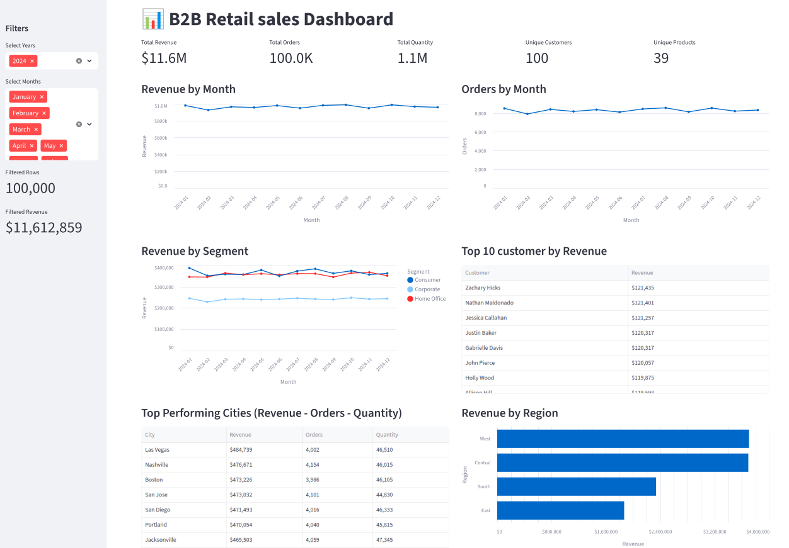

# Smart Sales Analyzer

End-to-end B2B retail analytics platform featuring an ETL pipeline, dimensional data warehouse, and interactive dashboard. Uses synthetic sales data for testing and demonstration, with data quality validation via Great Expectations and interactive insights through Streamlit.

<div align="center">

<div><i>Interactive sales analytics dashboard with real-time filtering</i></div>
</div>


## Features

- **ETL Pipeline** – Automated data extraction, transformation, and loading with data quality checks
- **Dimensional Modeling** – Star schema warehouse with fact and dimension tables in DuckDB
- **Synthetic Data** – Deterministic faker-based generator for testing and development
- **Interactive Dashboard** – Real-time filtering and 8+ visualizations for sales insights
- **Data Validation** – Great Expectations integration for quality assurance

## Project Structure

```
smart_sales_analyzer/
├── src/
│   ├── etl.py                         
│   ├── synthetic_data_generator.py     
│   ├── build_dimensional_model.py  
│   └── dashboard.py                   
├── data/
│   ├── input/                 
│   └── output/                         
└── requirements.txt                 
```
## Skills Demonstrated

**Data Engineering:** ETL Pipeline Development • Data Quality Validation (Great Expectations) • Dimensional Modeling (Star Schema) • Data Warehousing (DuckDB) • Parquet File Format
**Data Processing:** Python • Pandas • Data Cleaning & Transformation • Synthetic Data Generation (Faker)
**Analytics & Visualization:** Streamlit • Business Intelligence Dashboards • SQL Query Optimization
**Development Practices:** Logging • Error Handling • Modular Code Design • Git Version Control

## Requirements

- Python 3.10+
- 2-3 GB free disk space

## Quick Start

### 1. Installation

```bash
git clone <repo-url>
cd smart_sales_analyzer
python -m venv .venv
source .venv/bin/activate
pip install -r requirements.txt
```

### 2. Run ETL Pipeline

```bash
python src/etl.py
```

Run with explicit parameters (recommended for reproducibility):

```bash
python src/etl.py \
  --rows 100000 \
  --start-date 2024-01-01 \
  --end-date 2024-12-31 \
  --rebuild \
  --build-star-schema
```

**Pipeline Steps:**
1. **Generate** – Creates synthetic B2B sales data using [product_catalog.json](data/input/product_catalog.json)
2. **Clean** – Removes duplicates, handles nulls, validates data types
3. **Validate** – Runs Great Expectations quality checks
4. **Load** – Saves to Parquet, exports CSV summaries, loads into DuckDB

**Useful ETL flags:**

- `--rows`: number of synthetic rows to generate.
- `--start-date` and `--end-date`: dataset date range.
- `--rebuild` or `--reuse`: regenerate data or reuse existing parquet.
- `--build-star-schema` or `--skip-star-schema`: build dimensional model or skip it.

To generate a different synthetic dataset distribution, change the seed in `src/synthetic_data_generator.py`.

### 3. Launch Dashboard

```bash
streamlit run src/dashboard.py
```

Opens interactive dashboard at `http://localhost:8501`

### 4. Run Tests

```bash
python -m unittest discover -s tests -q
```

## Dashboard Features

The Streamlit dashboard provides:

- **KPI Metrics** – Revenue, Orders, Quantity, Customers, Products
- **Filters** – Year and month selection
- **Visualizations:**
  - Revenue & Orders by Month (line charts)
  - Revenue by Segment (multi-line chart)
  - Top 10 Customers (table with revenue, orders, quantity)
  - Top Performing Cities (Revenue - Orders - Quantity) (sortable table)
  - Revenue by Region (horizontal bar chart)
  - Revenue by Category (table)
  - Top 10 Products (Revenue - Orders - Quantity)

## Outputs

| File | Description |
|------|-------------|
| `data/output/synthetic_data.parquet` | Full cleaned dataset |
| `data/output/yearly.csv` | Yearly revenue aggregates |
| `data/output/segment_yearly.csv` | Segment performance by year |
| `data/output/regional_revenue.csv` | Revenue by region |
| `data/output/top_products.csv` | Best-selling products |
| `data/output/quality_report.json` | Data validation results |
| `data/output/sales_analytics.duckdb` | Star schema warehouse |
| `etl_pipeline.log` | Pipeline execution log |

## Data Warehouse Schema

Star schema implementation in DuckDB:

```
        dim_customer
              |
dim_date ── fact_sales ── dim_product
              |
        dim_location
```

### Dimension Tables

| Table | Description | Key Attributes |
|-------|-------------|----------------|
| **dim_customer** | Customer master data | customer_id, name, segment |
| **dim_product** | Product catalog | product_id, name, category, sub_category |
| **dim_location** | Geographic hierarchy | city, state, postal_code, region, country |
| **dim_date** | Calendar dimension | date, year, month, week, month_name |

### Fact Table

**fact_sales** – Grain: One row per order line item
- Foreign keys: customer_id, product_id, location_id, order_date
- Measures: sales_amount, quantity, unit_price, ship_latency_days

### Access the data warehouse in DuckDB:

```bash

duckdb data/output/warehouse/sales_analytics.duckdb

# Query to use dim table
SELECT * FROM dim_customer LIMIT 10;
SELECT * FROM dim_product WHERE category = 'Technology';
SELECT * FROM dim_location WHERE region = 'West';
SELECT * FROM dim_date WHERE year = 2023;

# Query to use fact table 
SELECT * FROM fact_sales LIMIT 10;}

# Analytical query as an example
SELECT
  d.year,
  d.month_name,
  SUM(f.sales_amount) as revenue
FROM fact_sales f
JOIN dim_date d ON f.order_date = d.date
GROUP BY d.year, d.month_name
ORDER BY d.year, d.month;
```
